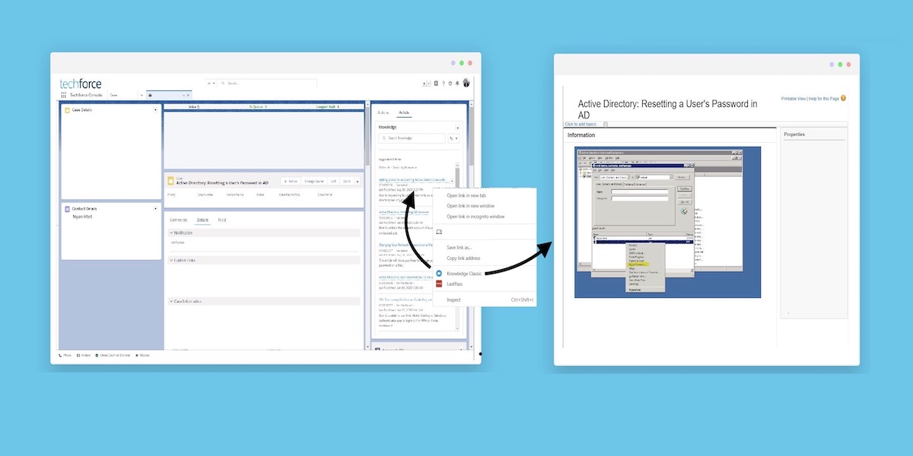

# Knowledge Classic 

This is a Google Chrome Extension I developed for Salesforce internal IT team through the Techforce Innovation Program. 

## Background

- "Printable View" is a limitation for Knowledge Lightning so we are no longer able to view Knowledge Articles in a new window while working on cases. 

- Without the Lightning extension, when we open a new browser window of Supportforce, you'll get logged out of OMNI. 

- This extension that resolves that issue and allows you open the lightning knowledge articles by converting it into Classic first. 

#

### Check it out on the Google Store!
[Knowledge Classic](https://chrome.google.com/webstore/detail/knowledge-classic/gmdbpnjnceiomokflphcodnbfpceimcd?hl=en&authuser=1)

#
